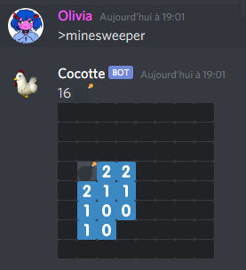

## THANKS 

This is my first Javascript project. It was more of an exercice than a real project and I learned a lot during the making of it. I didn't really check how others make their minesweepers, so mine can be a little unoptimized : my way of generating random numbers seems a little off, I should check that. I didn't intend on sharing this project, but I will do a proper README and explain how to install it on your Discord bot just in case.

## HOW TO PUT IT ON YOUR BOT

I'll explain the following assuming you already have a discord bot and you know how to modify/launch it.

1. Put minesweeper.js in the same folder as the main file of your bot.
2. Add `const minesweeper = require("./minesweeper.js");` and all the `bot.on("message", message => {}` bloc into your main bot file.
3. `const bombs = + args[0] || 16;` and `const emoji = args[1] || "\u{1F4A3}";` are the default values for the number of bombs, here 16, and the emoji used for bombs, here a bomb emoji. Feel free to change those values to better suit your needs.
4. In `(message.content.startsWith(PREFIX + "minesweeper")`, you can change `(PREFIX + "minesweeper)` to better suit the need of your bot. If your bot doesn't have a PEFIX const, add "const PREFIX = '>'" to your main file. I'll assume you're using the same prefixe as mine.

## HOW DOES THE BOT WORK

Sending >minesweeper will create a 8 X 8 minesweeper game with the default number of bombs (16) and the default emoji ('\u{1F4A3}', a bomb emoji).

You can choose how many bombs you want in your game by adding it in your message like this :

\>minesweeper 36

In this example, I created a game with 36 bombs. You have to choose a number between 0 and 64 otherwise the bot will not execute the script and tell you to choose a valid number.

You also can choose any other emoji that is on your discord to represent the bomb like this :

\>minesweeper 20 :heart:

In this example, I created a game with 20 hearts.

You can play with custom emojis if they are available on your server.

\>minesweeper 16 :Rastapopoulos:

If you don't tell how many bombs you want, it will put the default amount of bombs into the grid.

Discord can't post a message with 2000+ characters, and you sometimes hit the limit when you ask for a lot of bombs with a long emoji name. The bot will send you an error message.

